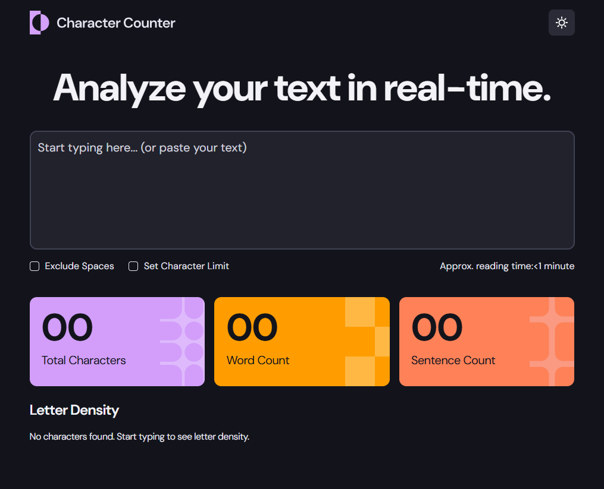
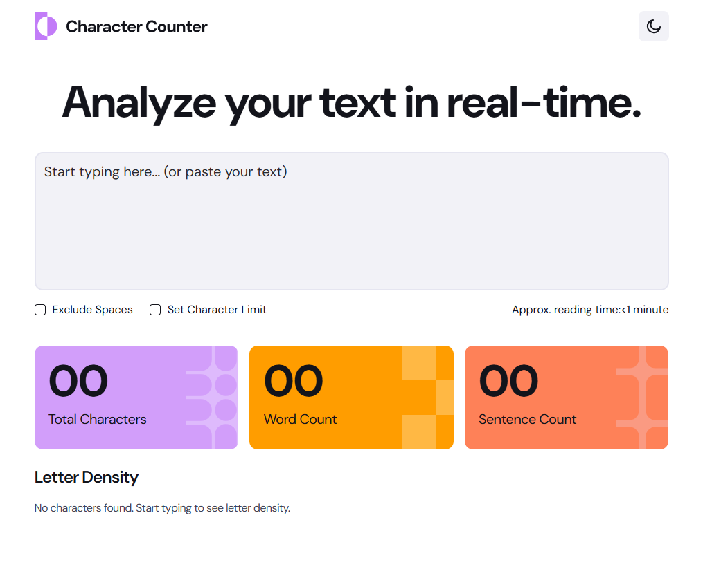

# Frontend Mentor - Character counter

This is a solution to the [Character counter](https://www.frontendmentor.io/challenges/character-counter-znSgeWs_i6). Frontend Mentor challenges help you improve your coding skills by building realistic projects.

## Table of contents

- [Overview](#overview)
  - [The challenge](#the-challenge)
  - [Screenshot](#screenshot)
  - [Links](#links)
- [My process](#my-process)
  - [Built with](#built-with)
  - [What I learned](#what-i-learned)
- [Author](#author)

## Overview

### The challenge

Your users should be able to:

- Analyze the character, word, and sentence counts for their text
- Exclude/Include spaces in their character count
  Set a character limit
- Receive a warning message if their text exceeds their character limit
- See the approximate reading time of their text
  Analyze the letter density of their text
- Select their color theme
- Navigate the app and perform all actions using only their keyboard
- View the optimal layout for the interface depending on their device's screen size
- See hover and focus states for all interactive elements on the page

### Screenshot

### Links

- Solution URL: https://github.com/JairRaid/Character-counter
- Live Site URL: https://jairraid.github.io/Character-counter/

## My process

### Built with

- Semantic HTML5 markup
- React
- Typescript
- Tailwind
- Flexbox
- CSS Grid
- Mobile-first workflow

### What I learned

I learned to:

- Build an interactive character counter with React and TypeScript.
- Calculate character, word, sentence, and reading-time statistics from user input.
- Create reusable components and manage application state with React hooks.
- Add options for excluding spaces and enforcing a custom character limit.
- Display validation and warning messages when the character limit is exceeded.
- Generate a letter-density analysis from the entered text.
- Implement light and dark themes and persist the selected theme.
- Create a responsive, accessible interface with keyboard navigation and visible focus states.
- Use Tailwind CSS, Flexbox, and CSS Grid to build a mobile-first layout.

## Author

- Email: rakotonirainyriija@gmail.com
- Facebook: https://web.facebook.com/jair.rakoto.3/
